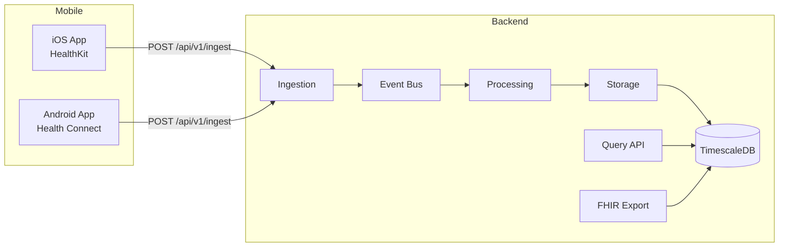

# OpenCadence

Self-hostable health data pipeline for wearable devices.

Collect vitals from your Apple Watch, Pixel Watch, or any wearable — own your data, query it via API, export it as FHIR R4.

## Architecture



## Quick Start

```bash
git clone https://github.com/your-org/opencadence.git
cd opencadence
cp deploy/docker/.env.example deploy/docker/.env
# Edit .env to set OC_JWT_SECRET
docker compose -f deploy/docker/docker-compose.yml up -d
```

The API is available at `http://localhost:8000`. Interactive docs at `http://localhost:8000/docs`.

### Seed Demo Data

```bash
make seed
```

## API Overview

### Ingest Data

```bash
curl -X POST http://localhost:8000/api/v1/ingest \
  -H "Content-Type: application/json" \
  -d '{
    "device_id": "your-device-uuid",
    "batch": [{
      "metric": "heart_rate",
      "value": 72.0,
      "unit": "bpm",
      "timestamp": "2026-03-11T10:30:00Z",
      "source": "apple_watch_series_9"
    }]
  }'
```

### Query Data

```bash
# Raw samples
curl "http://localhost:8000/api/v1/data?device_id=UUID&metric=heart_rate&start=2026-03-11T00:00:00Z&end=2026-03-12T00:00:00Z&resolution=raw"

# 1-minute aggregates
curl "http://localhost:8000/api/v1/data?device_id=UUID&metric=heart_rate&start=2026-03-11T00:00:00Z&end=2026-03-12T00:00:00Z&resolution=1min"
```

### FHIR Export

```bash
curl "http://localhost:8000/fhir/Observation?device_id=UUID&metric=heart_rate&start=2026-03-11T00:00:00Z&end=2026-03-12T00:00:00Z"
```

## Supported Metrics

| Metric | Unit | LOINC Code |
|--------|------|------------|
| Heart Rate | bpm | 8867-4 |
| HRV | ms | 80404-7 |
| SpO2 | % | 2708-6 |
| Respiratory Rate | breaths/min | 9279-1 |
| Skin Temperature | C | 39106-0 |

## Adding a New Metric

Create a YAML file in `backend/src/core/metrics/`:

```yaml
name: my_metric
label: My Metric
unit: units
valid_range:
  min: 0
  max: 100
aggregation: mean
processors:
  - validators.RangeValidator
fhir:
  code: "12345-6"
  system: "http://loinc.org"
  display: "My Metric"
```

See [CONTRIBUTING.md](CONTRIBUTING.md) for details.

## Development

```bash
make install    # Install dependencies
make dev        # Start dev server with hot reload
make test       # Run unit tests
make lint       # Run linter and type checker
```

## License

Apache 2.0 - see [LICENSE](LICENSE) for details.
